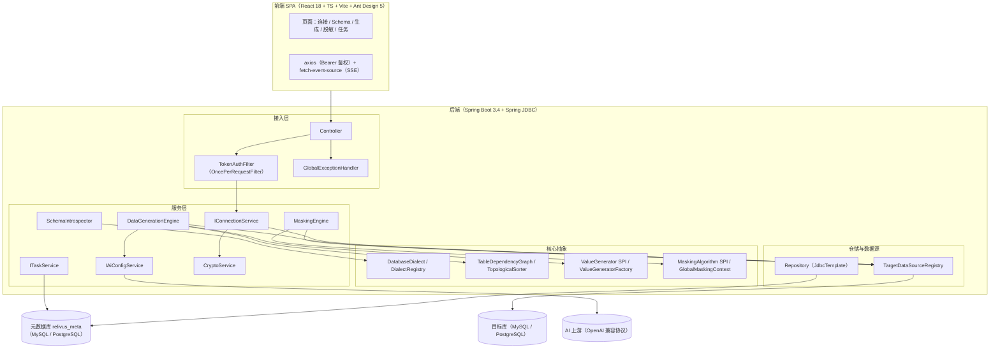
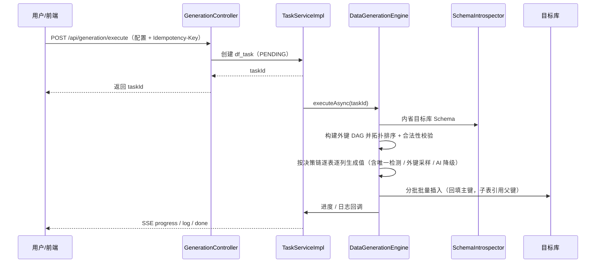
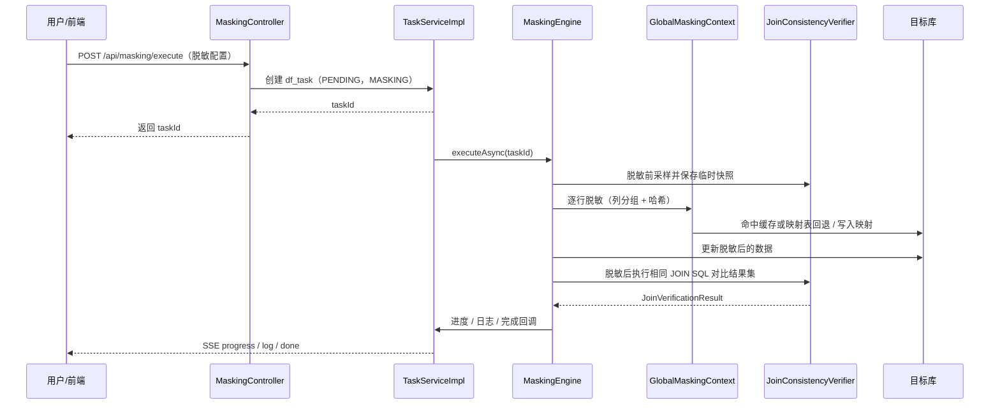

# Relivus 总体设计

| 文档版本 | 更新日期 | 状态 |
|---|---|---|
| v1.0 | 2026-09-18 | 正式 |

## 1. 设计目标与原则

- **单用户内部工具**：不引入 RBAC、登录、SSO、多租户，保持实现精简。
- **接口先行**：所有能力先定义接口，再给出实现，核心实现类加 `@Service` / `@Component`。
- **无 ORM**：元数据访问统一使用 Spring JDBC（`JdbcTemplate`），方言差异通过 `DatabaseDialect` 抽象收敛。
- **契约冻结优先**：鉴权、统一任务表、配置键、错误码等 P0 契约一经冻结不再随意变更。
- **主链路无 AI 可运行**：AI 生成仅作为列级可选增强，失败可降级，不影响整体生成。
- **不迁移目标库**：Flyway 只迁移元库，目标库结构只读使用。
- **机密零落盘明文**：密码、AI key、HMAC 密钥全程加密存储与内存短生命周期。
- **无 Docker 部署**：部署采用裸机 / systemd + Nginx；Testcontainers 仅用于测试。

## 2. 总体架构

系统由前端 SPA、后端分层服务、元数据库与目标数据库四部分构成。



## 3. 模块划分与职责

| 模块（包） | 职责 | 关键类 |
|---|---|---|
| `com.relivus.dialect` | 方言抽象与 SQL 构建，屏蔽 MySQL / PostgreSQL 差异 | `DatabaseDialect`、`DialectRegistry`、`MySQLDialect`、`PostgreSQLDialect`、`DataTypeMapping`、`PaginationSyntax` |
| `com.relivus.schema` | 目标库结构内省、领域模型与缓存 | `SchemaIntrospector`、`JdbcSchemaIntrospector`、`SchemaCache`、`CheckConstraintParser`、`model.*` |
| `com.relivus.generator` | 测试数据生成引擎、依赖图、值生成器与批量插入 | `DataGenerationEngine`、`TableDependencyGraph`、`TopologicalSorter`、`ValueGeneratorFactory`、`ValueGenerator`（及内置实现）、`UniqueConstraintChecker`、`ForeignKeySampler`、`BatchInserter`、`AiGenerator` |
| `com.relivus.masking` | 脱敏算法、全局映射一致性与 JOIN 验证 | `MaskingAlgorithm`（及内置实现）、`MaskingEngine`、`GlobalMaskingContext`、`MaskMappingRepository`、`RelatedColumnDetector`、`JoinConsistencyVerifier` |
| `com.relivus.task` | 统一任务模型、异步执行、取消与 SSE | `ITaskService` / `TaskServiceImpl`、`ITaskDataService` / `TaskDataServiceImpl`、`TaskJob`、`TaskContext`、`TaskStatus`、`TaskProgressNotifier`、`SseTaskProgressNotifier`、`SseProgressController` |
| `com.relivus.ai` | OpenAI 兼容上游客户端 | `AiHttpClient`、`RestClientAiHttpClient`、`AiProviderConfig` |
| `com.relivus.service` | 业务编排（连接、AI 配置、加解密） | `IConnectionService` / `ConnectionServiceImpl`、`IAiConfigService` / `AiConfigServiceImpl`、`CryptoService`、`TargetDataSourceRegistry` |
| `com.relivus.controller` / `dto` | REST API 与请求 / 响应 DTO | `ConnectionController`、`SchemaController`、`GenerationController`、`MaskingController`、`TaskController`、`AiConfigController` |
| `com.relivus.repository` / `entity` | 元库数据访问与实体映射 | `ConnectionRepository`、`TaskRepository`、`TaskLogRepository`、`MaskMappingRepository`、`AuditLogRepository`、`AiConfigRepository` |
| `com.relivus.common` | 统一响应、异常、错误码、幂等 | `ApiResponse`、`RelivusException`、`ErrorCode`、`GlobalExceptionHandler`、`IdempotencyGuard` |
| `com.relivus.config` / `web` | 配置绑定、数据源、Flyway、鉴权过滤 | `RelivusProperties`、`DataSourceConfig`、`FlywayConfig`、`TaskExecutorConfig`、`TokenAuthFilter`、`TraceIdFilter` |

## 4. 关键技术设计

### 4.1 生成引擎决策链

单列取值的优先级从高到低：

```text
用户配置 > 自增跳过 > 外键 > ENUM > CHECK > 主键 > 列名启发式 > 类型默认
```

- 用户配置：`GenerationConfig.TableConfig.ColumnConfig` 指定生成器（如 `ai`、`fixed`）。
- 自增跳过：主键自增列交由数据库生成，不主动赋值。
- 外键：优先由 `ForeignKeySampler` 从父表已插入行采样。
- ENUM / CHECK：在允许值或范围内取合法值。
- 主键：非自增主键生成唯一序列。
- 列名启发式：按 email / phone / name / address / price 等模式映射到 Faker / Regex 生成器。
- 类型默认：按列类型与方言类型映射兜底。

### 4.2 外键 DAG 与拓扑序

- `TableDependencyGraph` 基于 JGraphT 建图；自引用外键不加入边集。
- `TopologicalSorter` 使用 Kahn 算法；检测到环时做两阶段处理——第一阶段外键置 NULL，第二阶段 UPDATE 回填。
- 循环依赖仅支持外键可空，任一环中外键 NOT NULL 时抛 `130003`（历史码 `3003`）。
- 父表插入用 `GeneratedKeyHolder` 回填自增主键，子表外键引用回填 ID；无依赖表可并行处理。

### 4.3 唯一约束双层策略

- 第一层：数据库唯一约束兜底，捕获 `DataIntegrityViolationException` 后重新生成。
- 第二层：本地 Caffeine LRU 缓存最近 10000 个值，降低碰撞概率。
- 冲突重试最多 100 次；低基数列 10 次仍冲突抛 `130002`（历史码 `3002`）。

### 4.4 任务异步与 SSE

- 统一任务表 `df_task`，状态机 `PENDING -> RUNNING -> SUCCESS / FAILED / CANCELLED`。
- `TaskServiceImpl` 管理 `Map<Long, Future<?>>` 与 `Map<Long, AtomicBoolean>`，每批完成后检查取消标志。
- 线程池 core 4 / max 8 / queue 100，拒绝策略抛 `150004`。
- SSE 统一路径 `/api/tasks/{id}/progress`，按 taskId 维护 `Map<Long, Set<SseEmitter>>`，最大连接 20、心跳 15 秒、超时 30 分钟；事件 `progress` / `log` / `done` / `error` / `heartbeat`。

### 4.5 幂等（Idempotency-Key）

- `POST /api/generation/execute`、`/preview` 与 `/api/masking/execute`、`/preview`、`/verify` 支持 `Idempotency-Key` 请求头。
- 相同幂等键重复提交仅产生一次副作用，避免误触重复生成 / 脱敏。

### 4.6 密码与 AI key 加密（AES-GCM 256）

- 连接密码与 AI key 均使用 AES-GCM 256 加密，密钥来自环境变量 `RELIVUS_AES_KEY`（Base64 32 字节）。
- 密文格式 `Base64(IV + cipherText + tag)`，落库字段 `password_cipher` / `api_key_cipher`。
- 解密仅在读取连接或解析 AI 明文配置时发生，内存短生命周期，绝不出现在日志与响应。
- 脱敏 HMAC 使用独立密钥 `RELIVUS_HMAC_KEY`，`key_version` 默认 1。

### 4.7 AI 调用与降级

- `RestClientAiHttpClient` 基于 RestClient 同步调用上游 `{baseUrl}/chat/completions`（OpenAI 兼容协议）。
- 请求体用 Jackson 序列化（禁止手拼 JSON），响应 `choices[0].message.content` 做宽容解析（JSON 数组优先，失败按行剥壳）。
- 仅 5xx / IO / 超时重试最多 3 次（退避 500ms 起递增），4xx 不重试；业务失败统一抛 `160002`。
- `AiGenerator` 每次批量请求 64 个值，缓存耗尽后再次请求；上游失败时降级为本地 DataFaker 假值，记录 WARN 任务日志且降级后不再回试。

### 4.8 错误码体系

- 六位三段式 `A-BB-CCC`：责任方 / 模块域 / 序号。
- `GlobalExceptionHandler` 统一映射 HTTP 状态（`1xxxxx` -> 4xx 或 502，`5xxxxx` -> 5xx）。
- 所有响应携带 `traceId`（源自 `X-Trace-Id` 或服务端生成），校验类错误附加 `fieldErrors`。
- 权威码表见 [api-spec.md](api-spec.md) 第 4 章。

## 5. 关键流程

### 5.1 数据生成流程



### 5.2 数据脱敏流程



## 6. 技术栈选型与理由

| 层 | 技术 | 版本 | 选型理由 |
|---|---|---|---|
| 语言 | Java（OpenJDK） | 17 | record、文本块等新特性，稳定 LTS |
| Web 框架 | Spring Boot | 3.4.x | 生态成熟，web / jdbc / validation 起步器齐备 |
| 数据访问 | Spring JDBC（`JdbcTemplate`） | 随 Boot | 无 ORM，直接可控 SQL，便于方言差异处理 |
| 数据库 | MySQL / PostgreSQL | 8.0 / 16 | 覆盖主流开源方言，验证双方言能力 |
| 连接池 | HikariCP | 随 Boot | 默认高性能连接池 |
| 迁移 | Flyway | 10.x | 版本化管理元库，按方言选目录 |
| 缓存 | Caffeine | 3.x | 内存缓存，用于 Schema 缓存与唯一值近邻缓存 |
| 图算法 | JGraphT | 1.5.x | 外键依赖图与拓扑排序 |
| 假数据 | DataFaker | 2.x | 高质量本地假数据与降级兜底 |
| AI 客户端 | Spring RestClient | 随 Boot | 仅 spring-web 无 webflux，同步调用 + 超时 + 重试 |
| 测试 | JUnit5 / Mockito / AssertJ / MockMvc / Testcontainers | 1.20.x | 覆盖单测与双库集成测试 |
| 前端 | React + TypeScript + Vite + Ant Design 5 + TanStack Query + Zustand + React Flow | 18 / 5 / 6 | 组件化、类型安全、状态与查询分离 |
| 前端 SSE | @microsoft/fetch-event-source | 最新稳定版 | 原生 EventSource 无法携带 Authorization 请求头 |

## 7. 设计权衡与已知限制

- **循环依赖仅支持外键可空**：NOT NULL 环通过两阶段插入也无法满足，直接以 `130003` 拒绝并提示用户先建立初始行。
- **唯一检测不做全局集合**：为控制内存，本地仅缓存最近 10000 个值，最终一致性由数据库唯一约束兜底。
- **AI 生成依赖外部服务**：上游不可用时降级为本地假数据，语义性下降但主链路不受影响；降级后不自动回试。
- **JOIN 一致性采用临时快照而非长事务**：大表长事务回滚代价高，故用采样快照方案，验证粒度受采样范围约束。
- **单活跃 AI 配置由应用层事务保证**：数据库层不做部分唯一索引，靠激活前全量置非活跃保证。
- **单用户工具定位**：无 RBAC / 登录 / 多租户，Token 为固定值，安全性依赖 Token 保密与内网部署。
- **无 Docker 部署**：部署与回滚依赖 systemd + Nginx 与数据库备份恢复，不引入容器编排。

## 关联文档

- [srs.md](srs.md) — 需求规格说明
- [database-design.md](database-design.md) — 数据库设计
- [api-spec.md](api-spec.md) — 接口规范与错误码
- [coding-standards.md](coding-standards.md) — 编码规范
- [testing.md](testing.md) — 测试说明