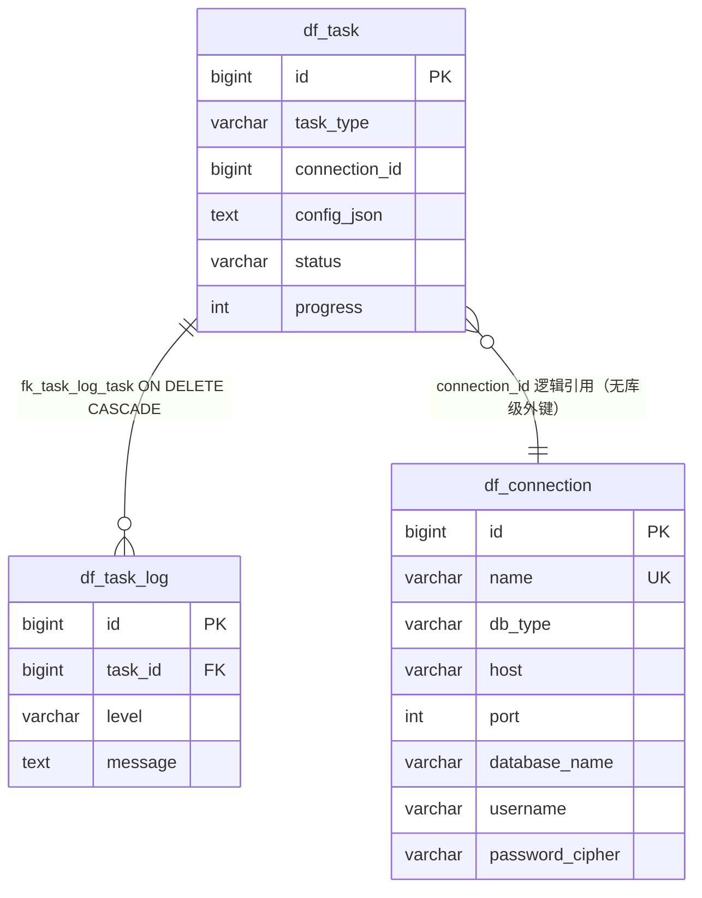

# Relivus 数据库设计

| 文档版本 | 更新日期 | 状态 |
|---|---|---|
| v1.0 | 2026-09-18 | 正式 |

## 1. 概述

Relivus 的数据库分为两个角色：

- **元库**：Relivus 自有库（默认 `relivus_meta`），存储连接、任务、日志、脱敏映射、审计与 AI 配置。表结构由 Flyway 在应用启动时自动迁移，方言按数据库类型自动选择 `db/migration/mysql` 或 `db/migration/postgresql` 目录。
- **目标库**：用户在连接管理中配置的 MySQL / PostgreSQL 库，作为内省、生成、脱敏的操作对象。Relivus 绝不迁移目标库结构。

双方言约定：

- 同一张表在 MySQL 与 PostgreSQL 两个脚本中字段名与语义一致，仅类型、自增、布尔等方言表达不同。
- 主键：PostgreSQL 用 `BIGINT GENERATED BY DEFAULT AS IDENTITY`，MySQL 用 `BIGINT AUTO_INCREMENT`。
- 时间戳：PostgreSQL 用 `TIMESTAMP`，MySQL 用 `TIMESTAMP`。
- 字符集：MySQL 表统一 `utf8mb4`，存储引擎 `InnoDB`。
- 本文档字段表以 PostgreSQL `V1__init.sql` / `V2__add_ai_config.sql` 为准；MySQL 差异在每表末尾说明。

## 2. 元库表设计

### 2.1 df_connection（目标库连接）

**用途**：存储目标库连接信息，密码为 AES-GCM 密文，绝无明文。

| 字段 | 类型 | 约束 | 说明 |
|---|---|---|---|
| id | BIGINT | PK，IDENTITY | 主键 |
| name | VARCHAR(64) | NOT NULL，UNIQUE | 连接名称 |
| db_type | VARCHAR(16) | NOT NULL | mysql / postgresql |
| host | VARCHAR(128) | NOT NULL | 主机 |
| port | INT | NOT NULL | 端口 |
| database_name | VARCHAR(64) | NOT NULL | 目标库名 |
| username | VARCHAR(64) | NOT NULL | 连接用户 |
| password_cipher | VARCHAR(512) | NOT NULL | AES-GCM 密文 `Base64(IV + cipherText + tag)` |
| created_at | TIMESTAMP | NOT NULL DEFAULT CURRENT_TIMESTAMP | 创建时间 |
| updated_at | TIMESTAMP | NOT NULL DEFAULT CURRENT_TIMESTAMP | 更新时间 |

**索引 / 约束**：`uk_connection_name UNIQUE (name)`。

**MySQL 差异**：`id` 为 `AUTO_INCREMENT`；`updated_at` 带 `ON UPDATE CURRENT_TIMESTAMP`。

### 2.2 df_task（统一任务表）

**用途**：生成与脱敏共用的统一任务主状态表，`task_type` 区分类型。

| 字段 | 类型 | 约束 | 说明 |
|---|---|---|---|
| id | BIGINT | PK，IDENTITY | 主键 |
| task_type | VARCHAR(32) | NOT NULL | GENERATION / MASKING |
| connection_id | BIGINT | NULL | 目标库连接 ID（逻辑引用 df_connection） |
| config_json | TEXT | NULL | 任务配置 JSON |
| status | VARCHAR(16) | NOT NULL DEFAULT 'PENDING' | PENDING / RUNNING / SUCCESS / FAILED / CANCELLED |
| progress | INT | NOT NULL DEFAULT 0 | 进度 0–100 |
| total_rows | BIGINT | NOT NULL DEFAULT 0 | 总行数 |
| processed_rows | BIGINT | NOT NULL DEFAULT 0 | 已处理行数 |
| error_message | TEXT | NULL | 错误信息 |
| cancel_requested | BOOLEAN | NOT NULL DEFAULT FALSE | 取消持久化标志 |
| created_at | TIMESTAMP | NOT NULL DEFAULT CURRENT_TIMESTAMP | 创建时间 |
| started_at | TIMESTAMP | NULL | 开始时间 |
| finished_at | TIMESTAMP | NULL | 结束时间 |

**索引 / 约束**：`idx_task_status (status)`、`idx_task_created (created_at)`。

**MySQL 差异**：`cancel_requested` 为 `BOOLEAN`（等同 `TINYINT(1)`）；`id` 为 `AUTO_INCREMENT`。

### 2.3 df_task_log（任务日志）

**用途**：记录任务运行日志，随任务级联删除。

| 字段 | 类型 | 约束 | 说明 |
|---|---|---|---|
| id | BIGINT | PK，IDENTITY | 主键 |
| task_id | BIGINT | NOT NULL，FK → df_task(id) ON DELETE CASCADE | 所属任务 |
| level | VARCHAR(16) | NOT NULL | INFO / WARN / ERROR |
| message | TEXT | NOT NULL | 日志内容（须脱敏） |
| created_at | TIMESTAMP | NOT NULL DEFAULT CURRENT_TIMESTAMP | 创建时间 |

**索引 / 约束**：`idx_task_log_task_id (task_id)`、外键 `fk_task_log_task`（`ON DELETE CASCADE`）。

### 2.4 df_mask_mapping（脱敏映射）

**用途**：保存「列组 × 原始值哈希 → 脱敏结果」，保证同组同原始值跨表一致，唯一键防并发重复写。

| 字段 | 类型 | 约束 | 说明 |
|---|---|---|---|
| id | BIGINT | PK，IDENTITY | 主键 |
| column_group | VARCHAR(255) | NOT NULL | 关联列分组 |
| original_hash | VARCHAR(64) | NOT NULL | SHA-256 十六进制 |
| masked_value | TEXT | NOT NULL | 脱敏结果 |
| algorithm | VARCHAR(64) | NOT NULL | 脱敏算法名 |
| key_version | INT | NOT NULL DEFAULT 1 | HMAC 密钥版本 |
| created_at | TIMESTAMP | NOT NULL DEFAULT CURRENT_TIMESTAMP | 创建时间 |

**索引 / 约束**：`uk_mask_group_hash UNIQUE (column_group, original_hash)`。

**并发写差异**：MySQL 用 `INSERT IGNORE`，PostgreSQL 用 `INSERT ... ON CONFLICT DO NOTHING`，统一由 `MaskMappingRepository` 封装。

### 2.5 df_audit_log（操作审计）

**用途**：记录本地关键操作，支持按动作与时间追溯。

| 字段 | 类型 | 约束 | 说明 |
|---|---|---|---|
| id | BIGINT | PK，IDENTITY | 主键 |
| action | VARCHAR(64) | NOT NULL | connection_create / generation_execute 等 |
| target | VARCHAR(255) | NULL | 操作对象 |
| detail | TEXT | NULL | 明细（敏感信息必须已脱敏） |
| result | VARCHAR(16) | NOT NULL DEFAULT 'success' | 结果 |
| trace_id | VARCHAR(64) | NULL | 请求链路 ID |
| created_at | TIMESTAMP | NOT NULL DEFAULT CURRENT_TIMESTAMP | 创建时间 |

**索引 / 约束**：`idx_audit_action (action)`、`idx_audit_created (created_at)`。

### 2.6 df_ai_config（AI 模型配置）

**用途**：存储 OpenAI 兼容上游配置，`api_key` 以 AES-GCM 密文存储；`active` 单活跃由应用层事务保证。

| 字段 | 类型 | 约束 | 说明 |
|---|---|---|---|
| id | BIGINT | PK，IDENTITY | 主键 |
| name | VARCHAR(64) | NOT NULL，UNIQUE | 配置名称 |
| base_url | VARCHAR(255) | NOT NULL | OpenAI 兼容接口基址 |
| api_key_cipher | VARCHAR(512) | NOT NULL | AES-GCM 密文，响应不回传明文 |
| model | VARCHAR(64) | NOT NULL | 模型名，如 deepseek-chat / glm-4-plus |
| active | BOOLEAN | NOT NULL DEFAULT FALSE | 当前激活配置 |
| created_at | TIMESTAMP | NOT NULL DEFAULT CURRENT_TIMESTAMP | 创建时间 |
| updated_at | TIMESTAMP | NOT NULL DEFAULT CURRENT_TIMESTAMP | 更新时间 |

**索引 / 约束**：`uk_ai_config_name UNIQUE (name)`、`idx_ai_config_active (active)`。

**MySQL 差异**：`active` 为 `TINYINT(1)`；`updated_at` 带 `ON UPDATE CURRENT_TIMESTAMP`。

## 3. 目标库约定

目标库由用户自行配置，Relivus 不迁移其结构。示例目标库 `relivus_demo`（`demo/postgresql/init.sql`）覆盖 ENUM、CHECK、UNIQUE 与外键，作为内省与生成的演示基准。

**users 表**：

| 字段 | 类型 | 约束 |
|---|---|---|
| id | bigint | PK，IDENTITY |
| email | varchar(255) | NOT NULL，UNIQUE（users_email_key），RFC 合规 ASCII 地址 |
| name | varchar(64) | NOT NULL，现代常用中文名（2~4 字），按 gender 联动生成（男名/女名分库） |
| age | integer | NOT NULL，CHECK 18 ≤ age ≤ 70 |
| gender | user_gender 枚举 | NOT NULL，男 / 女（无 O） |
| balance | numeric(18,2) | NOT NULL，DEFAULT 0，CHECK balance ≥ 0 |
| created_at | timestamp | NOT NULL，DEFAULT now()，生成值不超过当前时间 |

索引：`idx_users_name (name)`。

`user_gender` 枚举仅含 `男` / `女`（数据质量整改：删除 O/M/F 字母值，避免与数字 0 混淆）；`order_status` 枚举为 `NEW / PAID / SHIPPED / DONE`。

**orders 表**：

| 字段 | 类型 | 约束 |
|---|---|---|
| id | bigint | PK，IDENTITY |
| user_id | bigint | NOT NULL，FK → users(id) |
| amount | numeric(10,2) | NULL，CHECK amount > 0 |
| status | order_status 枚举 | NEW / PAID / SHIPPED / DONE，DEFAULT 'NEW' |
| created_at | timestamp | DEFAULT now() |

约束：`orders_amount_check (amount > 0)`、`orders_user_id_fkey FOREIGN KEY (user_id) REFERENCES users(id)`。

## 4. 表关系

说明：

- 仅 `df_task_log -> df_task` 存在库级外键（`ON DELETE CASCADE`）。
- `df_task.connection_id` 是到 `df_connection` 的逻辑引用（无数据库级外键），连接删除时由应用层控制行为。
- `df_mask_mapping`、`df_audit_log`、`df_ai_config` 为独立表，不参与外键关系。

## 5. 迁移规范

- 迁移脚本命名 `V{n}__desc.sql`（如 `V1__init.sql`、`V2__add_ai_config.sql`），按 `db/migration/{mysql,postgresql}` 分目录存放。
- **已发布迁移禁止修改**：历史迁移一经合入即冻结，结构调整统一通过新增版本迁移完成。
- 双方言同步：每次结构变更须同时提供 MySQL 与 PostgreSQL 两个脚本，字段名与语义保持一致，禁止 MySQL 语法出现在 PG 脚本中。
- Flyway 关闭 Spring Boot 自动迁移（`spring.flyway.enabled=false`），由 `FlywayConfig` 注入 `metaDataSource` 后按方言选择目录；`clean-disabled=true`、`baseline-on-migrate=true`。
- 生产环境禁止 `flyway clean`；回滚依赖数据库备份恢复（`scripts/backup.bat` / `scripts/restore.bat`）。

## 关联文档

- [SRS.md](SRS.md) — 需求规格说明
- [high-level-design.md](high-level-design.md) — 总体设计
- [api-spec.md](api-spec.md) — 接口规范与错误码
- [coding-standards.md](coding-standards.md) — 编码规范（含 SQL 与迁移规范）